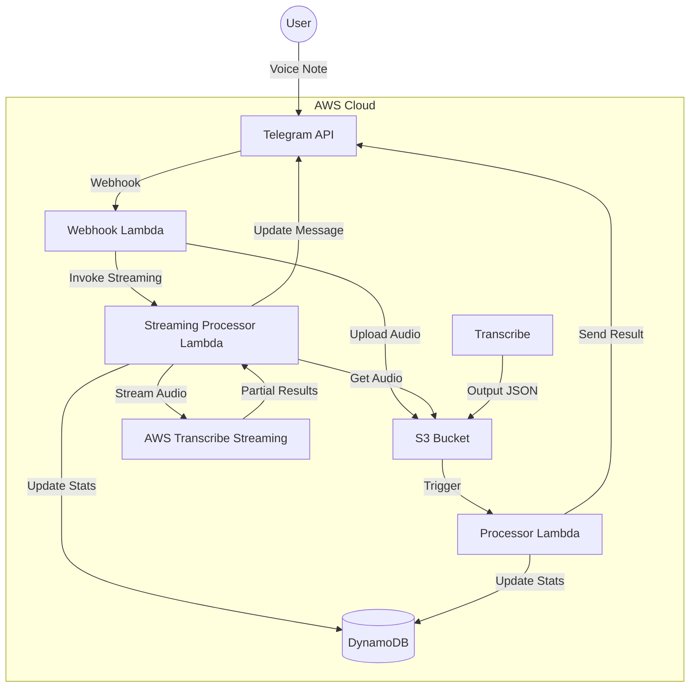

# Serverless Telegram Transcription Bot 🎙️🤖

This project deploys a fully serverless Telegram bot that transcribes Voice Notes and Audio Files using AWS Transcribe.

## ✨ Features
- **Real-time Transcription Feedback**: See the text appear chunk-by-chunk as the system processes your voice note (smoother UX than waiting for the end).
- **Batch Processing**: Handles uploaded audio files (MP3, WAV, etc.).
- **Automatic Language Detection**: Supports English and Hebrew (easily configurable in `src/streaming/index.js`).
- **Usage Stats**: Tracks your usage (duration, language) in DynamoDB.
- **Admin Control**: Whitelist-based access control.
- **100% Serverless**: Uses AWS Lambda, S3, DynamoDB, and Transcribe. No servers to manage!

## 🏗️ Architecture



## 🛠️ Prerequisites

1.  **AWS Account**: You need an AWS account.
2.  **AWS CLI**: Installed and configured with your credentials (`aws configure`).
3.  **Terraform**: Installed (v1.0+).
4.  **Telegram Bot**: Create a new bot via [BotFather](https://t.me/BotFather) and get the **Token**.
5.  **FFmpeg**: (Included in repo) The streaming lambda uses a static `ffmpeg` binary.

## 🚀 Setup Guide (0 to 10)

### 0. Clone the Repository
```bash
git clone <your-repo-url>
cd <your-repo-name>
```

### 1. Initialize Terraform
```bash
terraform init
```

### 2. Configure Variables
Create a `terraform.tfvars` file based on the example:
```bash
cp terraform.tfvars.example terraform.tfvars
```

Edit `terraform.tfvars` and fill in your details:
- `telegram_bot_token`: Your Bot Token from BotFather.
- `telegram_admin_username`: Your Telegram username (without `@`). This user will be the admin.
- `bucket_name`: A globally unique name for your S3 bucket (e.g., `my-transcribe-bot-123`).
- `aws_region`: (Optional) Default is `us-east-1`.

### 3. Review the Plan
See what resources will be created:
```bash
terraform plan
```

### 4. Deploy! 🚀
Create the infrastructure:
```bash
terraform apply
```
Type `yes` when prompted.

### 5. Verify Webhook
Terraform automatically sets the Telegram Webhook. You can verify it by visiting:
`https://api.telegram.org/bot<YOUR_TOKEN>/getWebhookInfo`

### 6. Test It
1.  Open your bot in Telegram.
2.  Send `/start` (it won't do much, but good to check).
3.  **Important**: Since you are the admin defined in `terraform.tfvars`, you are automatically authorized.
4.  Send a **Voice Note**. You should see "🎧 Processing..." and then real-time text updates.

### 7. Add Other Users (Optional)
By default, only the admin can use the bot. To add friends:
```
/add friend_username
```
To remove them:
```
/revoke friend_username
```
To list allowed users:
```
/list
```

### 8. Check Stats
Send `/stats` to see your usage (Total minutes, languages, etc.).

### 9. Troubleshooting
- **No response?** Check AWS CloudWatch Logs for the `transcribe_bot_webhook` Lambda.
- **"Stream too big"?** The code handles chunking, but if you see this, report an issue.
- **Wrong Language?** Currently optimized for English/Hebrew. You can change `LanguageOptions` in `src/streaming/index.js`.

### 10. Cleanup (Destroy)
To remove all resources and stop paying for them:
```bash
# First, empty the S3 bucket (Terraform won't delete a non-empty bucket)
aws s3 rm s3://<your-bucket-name> --recursive

# Then destroy infrastructure
terraform destroy
```

## � Costs

This project uses AWS services that have generous Free Tier limits.

### 🆓 AWS Free Tier (First 12 Months)
- **AWS Transcribe**: **60 minutes** of audio per month.
- **AWS Lambda**: **400,000 GB-seconds** of compute time per month.
- **Amazon S3**: **5 GB** of standard storage.
- **DynamoDB**: **25 GB** of storage and 25 RCU/WCU (Always Free).

### 💸 Standard Pricing (After Free Tier)
*Estimates based on us-east-1 (N. Virginia)*

| Service | Cost | Note |
| :--- | :--- | :--- |
| **AWS Transcribe** | **$0.024** per minute | The main cost driver. 1 hour = ~$1.44. |
| **AWS Lambda** | ~$0.20 per 1M requests | Very cheap for this use case. |
| **Amazon S3** | $0.023 per GB | Negligible for voice notes (deleted after processing). |
| **DynamoDB** | Pay-per-request | Negligible for simple metadata storage. |

**Example**: If you transcribe **2 hours** (120 mins) of audio per month:
- **Free Tier**: $1.44 (First 60 mins free, pay for next 60).
- **Standard**: **~$2.88** per month.

## �📜 License
MIT
